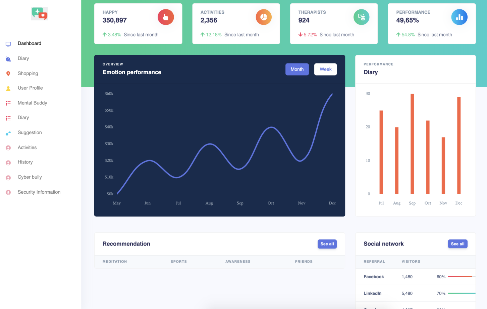
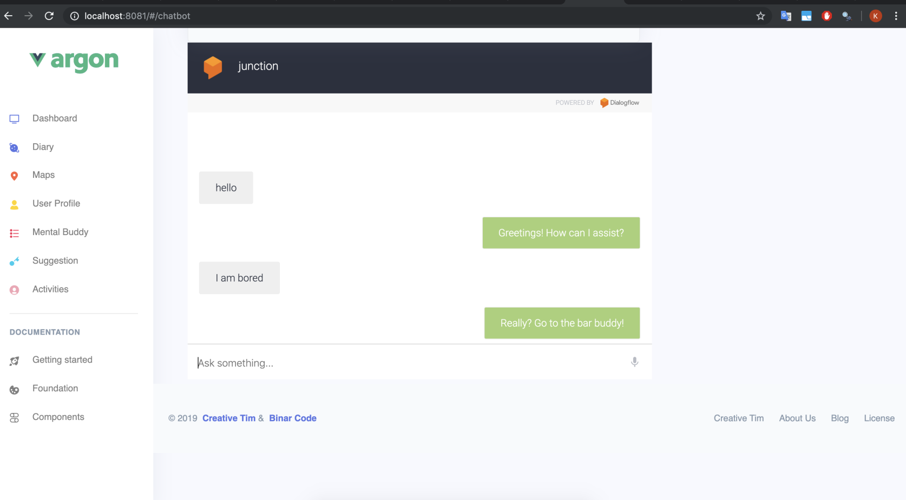
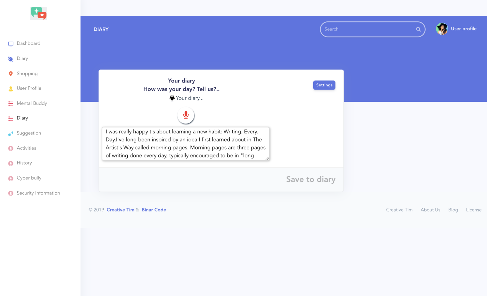
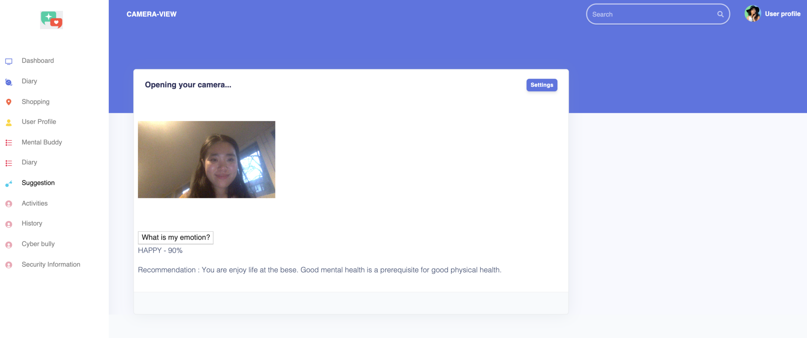
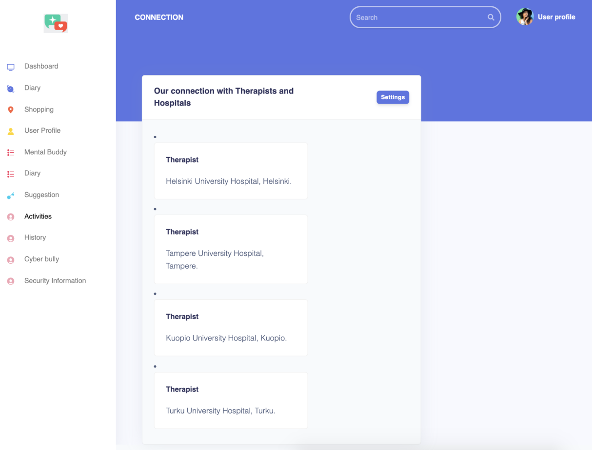

# junction2019
Junction 2019
Die hard in 48 hours of Junction - 48 hours of coding we implement this MVP product

##Digital buddy who psy you up.

### Dashboard analyze the performance of user emotions based on history of diaries kept by users, current emotions of user saved on the app 

### Chat bot - give recommendations based on user text input emotions (currently, there are angry, happy, fear, neutral , stress,etc)

### Diary - keep a history of daily emotions by speech recognition 

### User take a photo the app recognize the main emotions based on facial recoginition and give recommendation what user should do to improve better emotions

### App also connect to hospitals/ therapists and match the user health problems with correct specialist with the mental health problem 

## Technologies used
+ Java (Spring boot)
+ MySQL (dev) - Aiven MySQL (prod)
+ Vue.js 
+ Speech recognition 
+ Google Cloud Vision API 
+ Google cloud platform - Docker 
+ Dialogflow API 
+ Basic machine learning for recommendations system (we don't have massive datasets -> we just use some basic recommendations API for emotions)

## Security concerned(future take into account)
+ GDPR 
+ Save users emotions data on cloud database (?) 
+ Secure encryption user data 